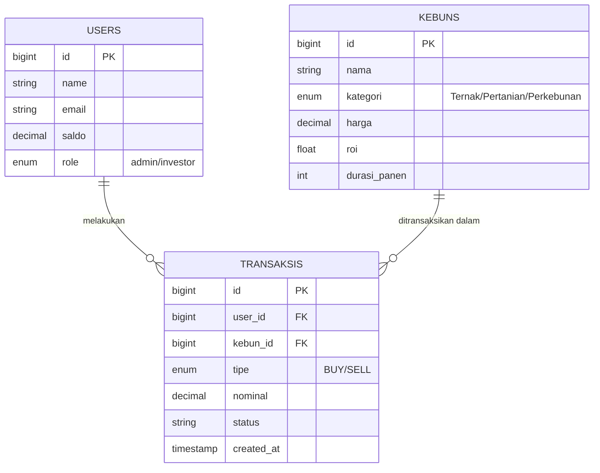

# CuanTani 🌾
**Platform Simulasi Trading & Manajemen Aset Agrikultur Berbasis Web**

  

**CuanTani** adalah platform simulasi investasi yang dirancang khusus untuk melatih kemampuan analisis pasar dan manajemen risiko bagi Taruna/Mahasiswa. Sistem ini mensimulasikan investasi di sektor riil (Peternakan, Pertanian, Perkebunan) serta trading komoditas tanpa risiko finansial nyata.

---

# 📖 Deskripsi & Tujuan

Aplikasi ini menggabungkan konsep **Manajemen Portofolio** dan **Trading Cepat**. Pengguna dapat membeli saham ternak untuk jangka panjang, atau melakukan trading *Call/Put* pada grafik harga XAU/AGRI secara *real-time*.

**Tujuan Utama:**
* Menyediakan platform simulasi investasi sektor ketahanan pangan.
* Meningkatkan literasi finansial Taruna melalui gamifikasi pasar modal.
* Memvisualisasikan pergerakan harga komoditas menggunakan *Interactive Candlestick Chart*.
* Memudahkan monitoring ROI (*Return on Investment*) aset ternak dan tani.

**Tech Stack:**
* **Backend:** Laravel 10 (PHP 8.2)
* **Frontend:** Blade Templates + Alpine.js
* **Styling:** TailwindCSS 3.0
* **Charting:** TradingView Lightweight Charts
* **Database:** MySQL 8.0

---

# 📋 User Story

| ID | User Story | Priority |
| :--- | :--- | :--- |
| **US-01** | Sebagai Investor, saya ingin melihat grafik harga pasar secara real-time untuk analisis tren. | **High** |
| **US-02** | Sebagai Investor, saya ingin membeli aset kelolaan (Ternak/Tani) dan memantau ROI-nya. | **High** |
| **US-03** | Sebagai Investor, saya ingin melihat detail aset (Lokasi, Manajer, Durasi Panen). | **High** |
| **US-04** | Sebagai Investor, saya ingin melakukan eksekusi Trading Cepat (Call/Put) dengan timer 1 menit. | **Medium** |
| **US-05** | Sebagai Admin, saya ingin mengelola data aset agar pasar tetap dinamis. | **Medium** |

---

# 📝 SRS - Feature List

### Functional Requirements
| ID | Fitur | Deskripsi | Status |
| :--- | :--- | :--- | :--- |
| **FR-01** | **Dashboard 3 Sektor** | Monitoring terpisah untuk Saham Ternak, Tani, dan Kebun dalam satu layar. | ✅ Done |
| **FR-02** | **Live Trading Chart** | Grafik Candlestick interaktif (XAU/AGRI) dengan update real-time. | ✅ Done |
| **FR-03** | **Asset Detail** | Halaman rincian aset, estimasi ROI, dan profil manajer kebun. | ✅ Done |
| **FR-04** | **Transaction System** | Mekanisme pembelian aset dengan validasi saldo otomatis. | ✅ Done |
| **FR-05** | **Portfolio Wallet** | Ringkasan total kekayaan dan riwayat kepemilikan aset. | ✅ Done |
| **FR-06** | **Auth System** | Login & Register khusus Member/Taruna. | ✅ Done |

### Non-Functional Requirements
* **Security:** Proteksi CSRF, Enkripsi Password (Bcrypt), Middleware Role.
* **Performance:** Load halaman dashboard dioptimalkan dengan query efisien.
* **Usability:** Desain responsif (Mobile/Desktop) dengan Tailwind Utility.

---

# 📊 UML Diagrams

Berikut adalah visualisasi arsitektur sistem yang di-render otomatis oleh GitHub.

### 1. Use Case Diagram
Interaksi antara Investor (Taruna) dan Sistem CuanTani.


### 2. Activity Diagram (Trading Flow)
Alur aktivitas saat investor melakukan simulasi trading.


### 3. ERD (Entity Relationship Diagram)
Struktur database dan relasi antar tabel.



---

# 🎨 Mock-Up / Screenshots

*(Tempat untuk screenshot aplikasi)*

| Dashboard Utama | Trading Arena | Detail Aset |
| :---: | :---: | :---: |
|  |  |  |

---

# 🔄 SDLC (Metodologi Pengembangan)

Proyek ini dikembangkan menggunakan metode **Waterfall**:

1.  **Planning:** Analisis kebutuhan pasar agrikultur & fitur trading.
2.  **Analysis:** Perancangan logika bisnis ROI & Fluktuasi Harga.
3.  **Design:** Perancangan Database (ERD) & UI/UX (Blade).
4.  **Development:** Coding Backend (Laravel) & Frontend (Tailwind).
5.  **Testing:** Uji coba fitur transaksi & validasi saldo.
6.  **Deployment:** Setup di lingkungan lokal.

---

# 🚀 Instalasi (Localhost)

Ikuti langkah ini untuk menjalankan proyek karena folder `vendor` tidak disertakan dalam repository.

### 1. Clone Repository
```bash
git clone [https://github.com/RahadianRonggo/Med-Reminder.git](https://github.com/RahadianRonggo/Med-Reminder.git)
cd Med-Reminder
```
*(Sesuaikan nama folder jika repository sudah di-rename menjadi CuanTani)*

### 2. Install Dependencies (Wajib)
```bash
composer install
npm install
```

### 3. Setup Environment
```bash
cp .env.example .env
php artisan key:generate
```
*Buka file `.env` dan atur `DB_DATABASE=cuantani`.*

### 4. Setup Database
```bash
php artisan migrate --seed
```

### 5. Jalankan Aplikasi
Buka dua terminal terpisah:
```bash
# Terminal 1
npm run dev

# Terminal 2
php artisan serve
```
Akses via browser: `http://127.0.0.1:8000`

---

# 🔐 Default Account

| Role | Email | Password |
| :--- | :--- | :--- |
| **Admin** | `admin@cuantani.com` | `password` |
| **Investor** | `taruna@cuantani.com` | `password` |

---

# 👨‍💻 Author

**Rahadian Ronggo Kusumo**
*Taruna Pratama - Politeknik Siber dan Sandi Negara*
*Program Studi Rekayasa Keamanan Siber*

> *"Membangun Ketahanan Pangan Melalui Teknologi Siber"* 🇮🇩🚜
